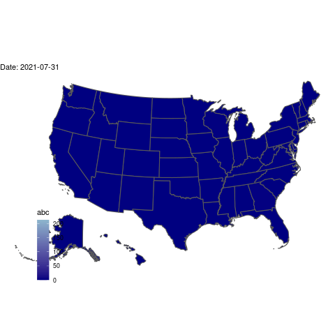

```{r setup, include=FALSE}
knitr::opts_chunk$set(echo = TRUE)
```


```{r}
#installing all of the packages needed for this code to run. Much of it was added as needed.
library(readxl)
library(tidyverse)
library(zipcodeR)
library(urbnmapr)
library(gganimate)
library(sf)
library(transformr)
library(lubridate)
library(plotly)
FinalEtsy <- read_csv('~/STA 518/ETSY2021/FinalEtsy.csv')
```


```{r Stateabbr}
#Using urbnmapr to get the geometry of states added to this dataset, matched using state_abbv
State_Ind <- right_join(get_urbn_map(map = "states", sf = TRUE),
                          FinalEtsy,
                          by = c("state_abbv" = "Ship State"))

#filtering all non-US orders and Puerto Rico orders out of the dataset
#changing date to be a date, not char
#creating a numeric variable called day that is days since start that the order was placed, and arranging the data by day
State_Ind_Year <- State_Ind %>% 
  filter(`Ship Country`=='United States' & `state_abbv` != 'PR') %>% 
  mutate(actualDate=as.Date(mdy(`Sale Date`))) %>% 
  mutate(day=actualDate-mdy('07-28-2021')) %>% 
  arrange(day)
```


```{r}
#Filters original data by US only
#creates a new data column and arranges by it
#duplicates state column, groups by state and date
#summarises to get sum of signs sold in day, keeps date and arranges by it.
AnimationDataTry <- FinalEtsy %>% 
  filter(`Ship Country`=="United States") %>% 
  mutate(date=mdy(`Sale Date`)) %>% 
  arrange(date) %>% 
  mutate(state=`Ship State`) %>% 
  group_by(state, date) %>% 
  summarise(Total_Sold=sum(`Number of Items`), date) %>% 
  arrange(date)

#removes any duplicate rows
NoDup <- AnimationDataTry %>% distinct()

#Uses summarise and group_by to get a column with all state names
stateListData <- State_Ind_Year %>% 
  group_by(state_abbv) %>% 
  summarise(total=sum(`Number of Items`))

#stores just the state names into a dataframe
#did this as opposed to using an api because it was readily available
stateList <- stateListData$state_abbv

#creates two empty vectors for states and day of sale
statesOver=c()
sellDay=c()
#formats start and end dates for while loop below
start <- as.Date("07-31-21",format="%m-%d-%y")
end   <- as.Date("10-08-21",format="%m-%d-%y")

#stores start in variable called theDate and checks to make sure it ran properly
theDate <- start
theDate

#this for loop interates through each state and possible sell day, creating two populated vectors
for(state in stateList){
  while (theDate <= end)
  {
    statesOver <- c(statesOver, state)
    sellDay <- c(sellDay, as_date(theDate))
    theDate <- theDate + 1                    
  }
  theDate <- start
}
#changes sellDay into a date again
sellDay <- as.Date(as.POSIXct(sellDay*24*60*60, origin = "1970-01-01", tz="UTC"))

#joins the two populated vectors to start a dataset
emptyTable <- data.frame(sellDay, statesOver)

#left_joins emptyTable and the population data from NoDup
fullTable <- left_join(emptyTable, NoDup, by=c("sellDay"="date", "statesOver"="state"))

#makes a new items variable, replacine NA in Total_Sold with 0
#group_by statesOver and adds a cumulative sum by state
fullTable <- fullTable %>% 
  mutate(items=ifelse(is.na(Total_Sold), 0,Total_Sold)) %>% 
  group_by(statesOver) %>% 
  summarise(sellDay, statesOver, items, cumulative = cumsum(items))

#creates several ways to shade a choropleth map
#This was done because shading with the raw value makes states with less than 50 signs barely change color due to California (over 200 signs shipped there) 
#makes a new day variable that will be iterable to plotly
plotTable <- fullTable %>% 
  mutate(numSold = ifelse(cumulative==0, 0,
                    ifelse(cumulative<5, 1,
                    ifelse(cumulative<10, 2,
                    ifelse(cumulative<20, 3,
                    ifelse(cumulative<50, 4,
                    ifelse(cumulative<100, 5,
                    ifelse(cumulative<200, 6, 7)))))))) %>% 
  mutate(logSold=ifelse(cumulative>0, log(cumulative+1), 0)) %>% 
  mutate(day = (month(sellDay)*100+day(sellDay)) )

#only needed once
#write_csv(plotTable, here::here("plotTable.csv"))


```

```{r}
#creates a choropleth using states as outlines, shading with logsold for best shading, a scale that is just above the highest logsold value to make cumulative shading look better, hovering gives the number of signs shipped to that state, frame is the day variable created above
USMAP <- plotTable %>% 
  plot_ly(
    type = 'choropleth',
    locations= ~statesOver,
    locationmode = 'USA-states' , 
    colorscale='tempo', z=~logSold,
    zmin=0, zmax=6,
    text=~cumulative,
    hoverinfo='text',
    showscale=FALSE,
    frame=~day) %>% 
  layout(geo=list( scope = 'usa' )) 

#saves the above 
library(htmlwidgets)
saveWidget(USMAP, "USMAP.html", selfcontained = F, libdir = "lib")
```

#This map is a gif. If you would like to view an interactive version, go to the "Map" tab.
```{r}

```

```{r}
htmltools::tags$iframe(
  width = "1024",
  height = "768",
  src = "USMAP.html", 
  scrolling = "no", 
  seamless = "seamless",
  frameBorder = "0"#,
  #style="-webkit-transform:scale(0.5);-moz-transform-scale(0.5);"
)
```


